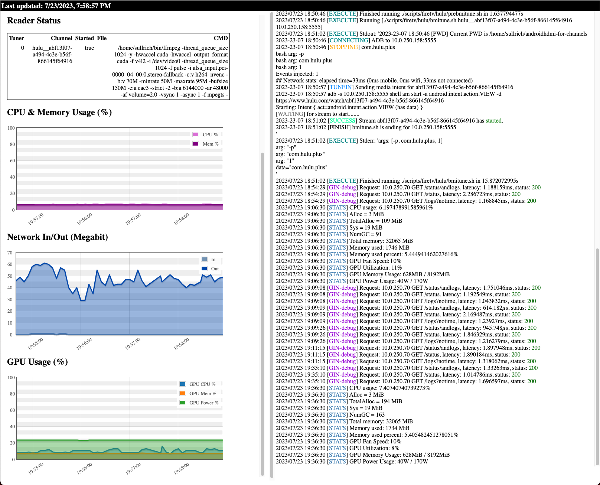

### Eye candy

(built in stats gui)

### This is a fork of https://github.com/tmm1/androidhdmi-for-channels with these features:

0. ENV variable support
1. Standardize and improve script durability / reliability
2. Allow multiple tuners from one set of scripts
3. Allowing the tuner and encoder information to be dynamically set.  Useful for docker containers, etc
4. Support for FireTV and Hulu
5. Test each pre script and if fails move on to next tuner before giving up
6. M3U file serving with templating for IP Address
7. Docker support
8. Application based tuners (IE: magewell, hauppauge colossus 2 & anything ffmpeg supports!)
9. E-Mail alerts on failures
10. Global logging to disk with rotation
11. Logging endpoint /logs for moments you do not have access to console with dynamic refresh!
12. Webhook support on failure use $reason variable in URL.
13. Custom script support - drop in your scripts and set STREAMER_APP env variable to match dir location
14. Web graphs of cpu, mem, gpu (nvidia)
15. Tee support (sending feed to a secondary target)
16. Application based tuning! Just send the feed to stdout
17. Dead video feeds restart - video locking up but audio working

#### Docker Instructions

1. Download the Docker convenience script:
   $ curl -fsSL https://get.docker.com -o get-docker.sh
2. Install Docker:
   $ sudo sh get-docker.sh
3. Install Portainer:
   $ sudo docker run -d -p 8000:8000 -p 9000:9000 -p 9443:9443 --name portainer \
    --restart=always \
    -v /var/run/docker.sock:/var/run/docker.sock \
    -v portainer_data:/data \
    cr.portainer.io/portainer/portainer-ce:latest
4. Configure Portainer and add androidhdmi-for-channels.yml via Portainer-Stacks:
   https://<hostname or IP of server>:9443
5. Add environment variable values to bottom section of Portainer-Stacks as defined in Docker compose.
6. Deploy container.
   Use re-pull image and redeploy slider if the container has been updated since the last time you downloaded it.
7. Check Portainer log for running container using Quick Actions button from Container list to check for errors.

#### Developer Instructions
First see https://github.com/sullrich/androidhdmi-for-channels/blob/main/getting_started.txt

